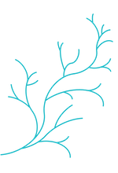

---
output:
  html_document:
    css: index_test.css
    theme: yeti
---

<style>
@import url('https://fonts.googleapis.com/css?family=Megrim&display=swap');
</style>

# Myfanwy Johnston, Ph.D
<br>

<div align="center"></div>

<br>

```{r setup, include=FALSE}
knitr::opts_chunk$set(echo = TRUE)
```

<div class = "row">
<div class = "col-xs-4">

## About

<br>

#### Background

PhD, Animal Behavior<br>
UC Davis 2017 <br>
BA & BS, Conservation & Resource Studies, Marine Science <br>
UC Berkeley 2009
<br>

#### Current
Senior Biologist, [Cramer Fish Sciences](http://fishsciences.net)
Modeling, Analysis and Synthesis Lab
Auburn, California

<br>
<br>


  
</div>

<div class = "col-xs-4">

##  Publications

<br>
<small>

Schumer, G., Crowley, K., Maltz, E., **Johnston, M.**, Anders, P., & Blankenship, S. Utilizing environmental DNA for fish eradication effectiveness monitoring in streams. Biological Invasions, 1-12.[html](https://link.springer.com/article/10.1007/s10530-019-02056-z)

**Johnston, M. E.**, Steel, A. E., Espe, M., Sommer, T., Klimley, A. P., Sandstrom, P., & Smith, D. (2018). Survival of Juvenile Chinook Salmon in the Yolo Bypass and the Lower Sacramento River, California. San Francisco Estuary and Watershed Science, 16(2).[pdf](https://cloudfront.escholarship.org/dist/prd/content/qt8bq7t7rr/qt8bq7t7rr.pdf)

**Johnston, M. E.**, Kelly, J. T., Lindvall, M. E., McElreath, R., & Klimley, A. P. (2017). Experimental evaluation of the use of vision and barbels as references for rheotaxis in green sturgeon. Journal of Experimental Marine Biology and Ecology, 496, 9-15.[pdf](http://www.eva.mpg.de/documents/Elsevier/Johnston_Experimental_JExpMarineBiolEcol_2017_2491416.pdf)
  
</small>  
</div>

<div class = "col-xs-4"> 
  
## Projects

<br>

[{fishpals} R package](https://github.com/Myfanwy/fishpals)  
<br>
[{fishtrackr} R package](https://github.com/Myfanwy/fishtrackr)  
<br>
[North American Rolex Scholar blog, 2009-2010](http://owussnorthamerica.org/category/scholar-journeys/2009-scholar-journey/)  

</div>
</div>
</div>
