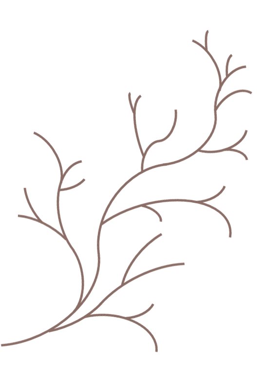

---
output:
  revealjs::revealjs_presentation:
    css: index.css
    reveal_options:
      progress: false
      controls: false
---

# Myfanwy  Johnston

######

I am a Ph.D. Candidate in the [Animal Behavior Graduate Group](http://anb.ucdavis.edu/index.html) at UC Davis.  

I study the behavioral ecology of migratory fishes in California, using acoustic telemetry. 

I also have a special place in my heart for programming all kinds of things in [R](http://cran.r-project.org/), but especially interactive reports and stand-alone web pages.
 

# Hub
###

###[At UC Davis](http://biotelemetry.ucdavis.edu/pages/bio_Johnston.asp)

###[GitHub](http://github.com/Myfanwy)

###[Twitter](http://twitter.com/Voovarb)

###[LinkedIn](http://linkedin.com/in/myfanwyjohnston/)

###[Blog](https://myfanwy.github.io/Blog)

<!---###Projects 
 

# Projects 
###
 
 
 

 

---->

