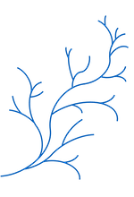

---
output:
  revealjs::revealjs_presentation:
    css: index.css
    reveal_options:
      progress: false
      controls: false
---

# Myfanwy  Johnston, Ph.D

######

 
Hi there!

I am a Senior Biologist at [Cramer Fish Sciences](http://www.fishsciences.net).  I am a recent graduate of the [Animal Behavior Graduate Group](http://anb.ucdavis.edu/index.html) at UC Davis.  

I study the behavioral ecology of migratory fishes in California. 

I also have a special place in my heart for programming all kinds of things in [R](http://cran.r-project.org/). 

 

# Hub
###

###[At UC Davis](http://biotelemetry.ucdavis.edu/pages/bio_Johnston.asp)

###[GitHub](http://github.com/Myfanwy)

###[Twitter](http://twitter.com/Voovarb)

###[LinkedIn](http://linkedin.com/in/myfanwyjohnston/)

<!---###Projects 
 

# Projects 
###
 
 
 

 

---->

