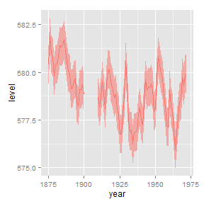
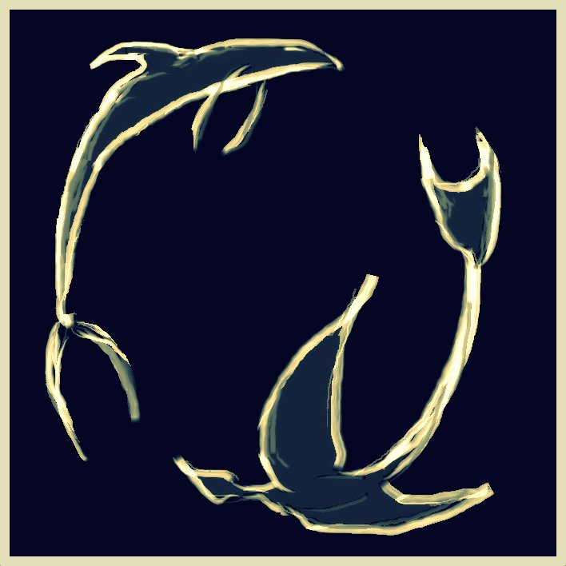

========================================================
title: false

</style bgimage= "concrete_seamless.png">
<link href='http://fonts.googleapis.com/css?family=Megrim' rel='stylesheet' type='text/css'>
<link href='http://fonts.googleapis.com/css?family=Raleway:300,400,700' rel='stylesheet' type='text/css'>
# Myfanwy 
# Johnston

[Projects](www.github.com/Myfanwy)

[Twitter](http://twitter.com/Voovarb)

[Academics](http://biotelemetry.ucdavis.edu/pages/bio_Johnston.asp)

[LinkedIn](www.linkedin.com/in/myfanwyjohnston/)

============
title: false
type: homepage
right: 50%
## Projects
 
[Introduction to ggplot2](https://github.com/Myfanwy/ggplot2Intro)

 
***
 
 
 
[Visual Tech Roundup 2015](http://www.voovarb.com/VisualTechRoundup2015/#/)
 
 

</style>
